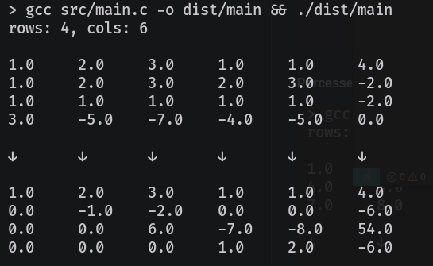

# Project Documentation

## Overview

This project provides a solution for processing matrices, it performs the Gaussian elimination algorithm.
The Gaussian elimination algorithm is a method for solving systems of linear equations by transforming the system's matrix into a row-echelon form. It works by performing row operations to eliminate variables from the equations, starting with the first column and working downwards. 

## Files

- **`main.c`**: Contains the main logic for processing the matrix, including matrix operations such as printing, pivoting, row substitution, and matrix reduction.
- **`data.c`**: Handles reading the matrix from a file (`input.dat`) and dynamically allocating memory for matrix storage.

## Functionality

### 1. Matrix Initialization (`data.c`)

- **Function**: `initialize_matrix()`
- **Description**: This function reads the matrix from a file (`input.dat`) where the number of rows and columns is specified at the start. It dynamically allocates memory for the matrix and fills it with the values read from the file.
- **Returns**: A pointer to a 2D array (`float**`) representing the matrix.

### 2. Matrix Printing (`main.c`)

- **Function**: `print_matrix(int rows, int cols, float** matrix)`
- **Description**: Prints the matrix to the standard output in a tabular format.
  
### 3. Pivot Identification (`main.c`)

- **Function**: `found_pivot(int rows, int cols, float** matrix)`
- **Description**: Finds and returns the pivot element (non-zero) in the matrix. The pivot is essential for performing row elimination.
- **Returns**: A pointer to a `pivot` structure containing the row and column of the found pivot.

### 4. Row Swapping (`main.c`)

- **Function**: `swap_rows(int rows, int cols, float** matrix, int r1, int r2)`
- **Description**: Swaps two rows in the matrix. This is typically done to move the pivot row to the top.

### 5. Row Substitution (`main.c`)

- **Function**: `substitute_row(int row, int cols, float** matrix, float alpha)`
- **Description**: Performs row substitution to eliminate entries below the pivot. A row is replaced with a combination of itself and a scaled version of another row.

$R_k \to R_k + \alpha R_1$
Where $k$ is the row of the element to eliminate, $\alpha$ is a coefficient $s.t.$  
$\alpha = -b / pivot$
   where b is the element under the pivot, that has to be scaled.

### 6. Matrix Reduction (`main.c`)

- **Function**: `kill_below_pivot(int rows, int cols, float** matrix, struct pivot* pivot_ij)`
- **Description**: Eliminates all values below the pivot by adjusting the rows below the pivot row. This is part of the Gaussian elimination process.
  
### 7. Recursive Matrix Resolution (`main.c`)

- **Function**: `resolve_matrix(int rows, int cols, float** matrix, FILE* output)`
- **Description**: Recursively reduces the matrix by identifying pivots, swapping rows, and eliminating values below the pivot until the entire matrix is reduced. The result is written to the `output.dat` file.

### 8. Main Execution (`main.c`)

- **Main Function**: `int main(int argc, char* argv[])`
- **Description**: The program begins by initializing the matrix, printing it, and then resolving it using the defined functions. The final output is written to a file.

## Usage

1. Prepare an input file (`input.dat`) in the following format:
   ```
   <number_of_rows> <number_of_columns>
   <matrix_values>
   ```

   Example:
   ```
   3 3
   1.0 2.0 3.0
   4.0 5.0 6.0
   7.0 8.0 9.0
   ```

2. Compile the program:
   ```bash
   gcc main.c -o main
   ```

3. Run the program:
   ```bash
   ./main
   ```

4. The output matrix will be saved in `output.dat`.

## Dependencies

- Standard C libraries:
  - `stdio.h`
  - `stdlib.h`
  - `stdbool.h`

## Future Improvements

- Implement error handling for matrix size mismatches.
- Optimize the algorithm for larger matrices.
- Add support for matrices with complex numbers.

## Example

#### Input


#### Porcessed Matrix


#### Output
